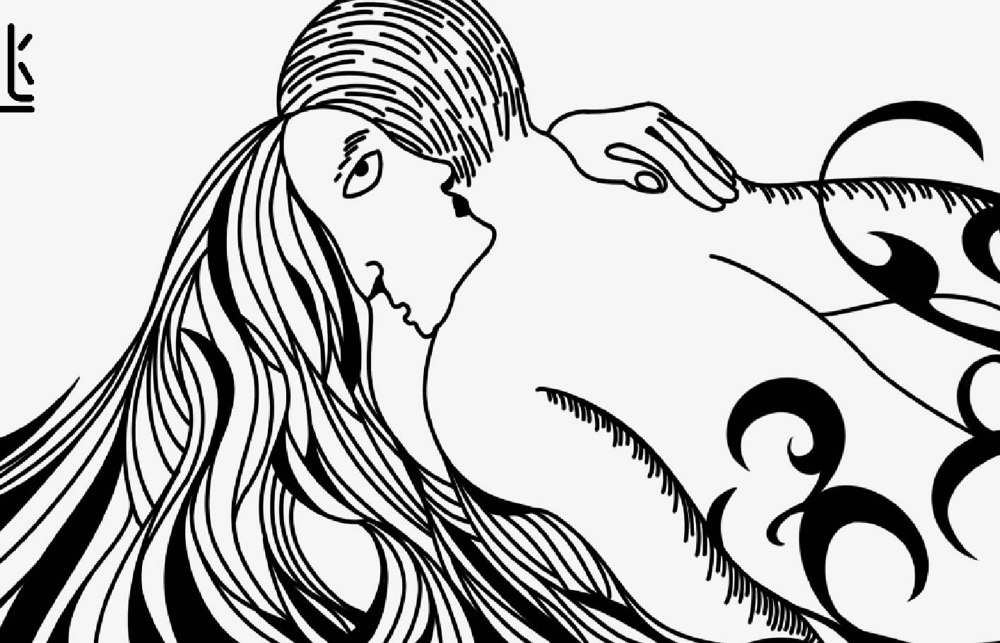
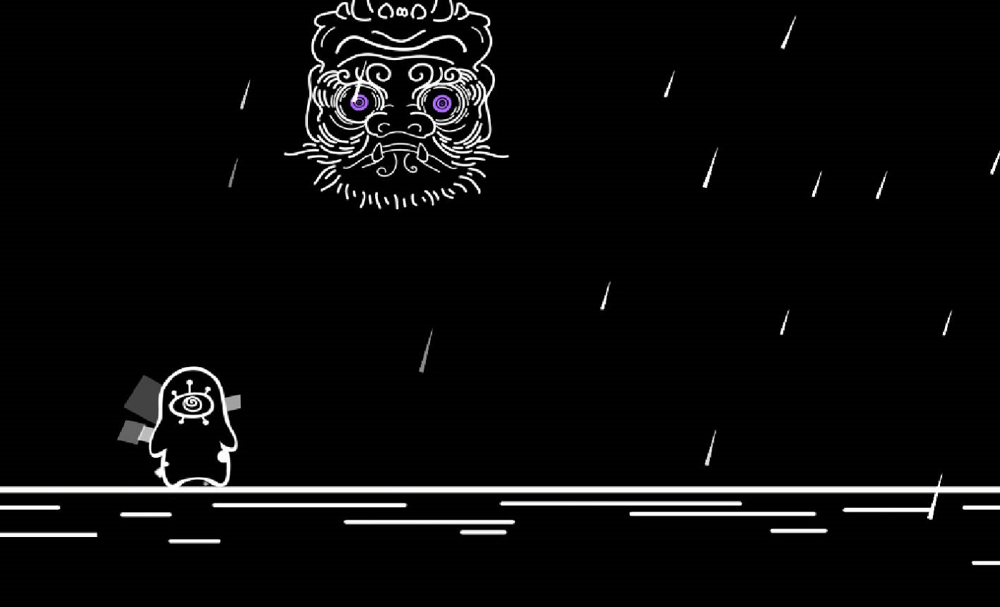
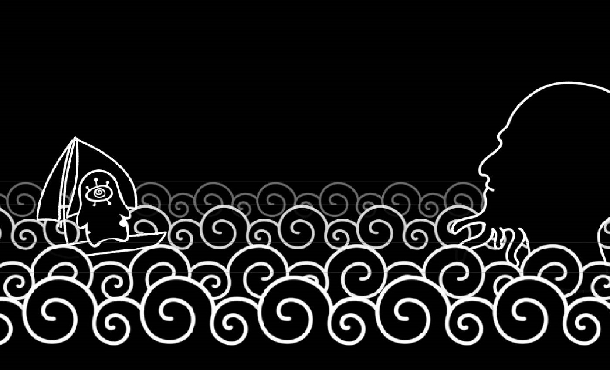
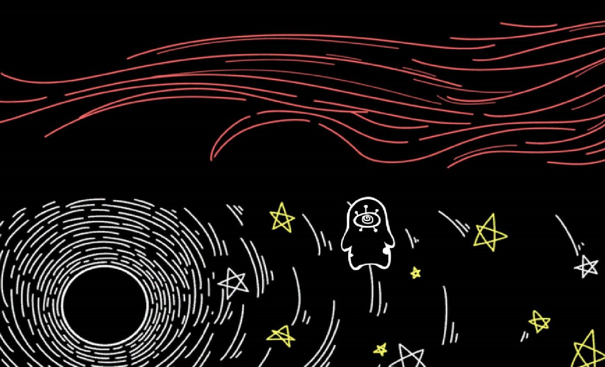

# Escape
<!-- 

    

     

     

 -->

level_1             | level_2
:-------------------------:|:-------------------------:
   |  

# Summary
Escape is the game built by group 11 that comes from CIGA GAME Jam 2018 Guangzhou Station, based on the topic given by the host. The topic is the first image shown above, which also is the cover of our game. Basically, it is a 2D side-scrolling game, showing us a story about the face escape from the woman to the man.